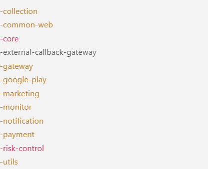
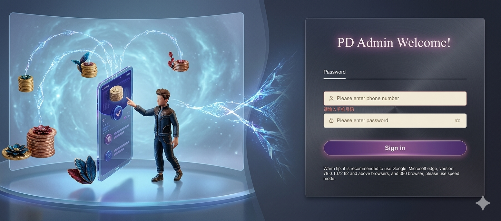
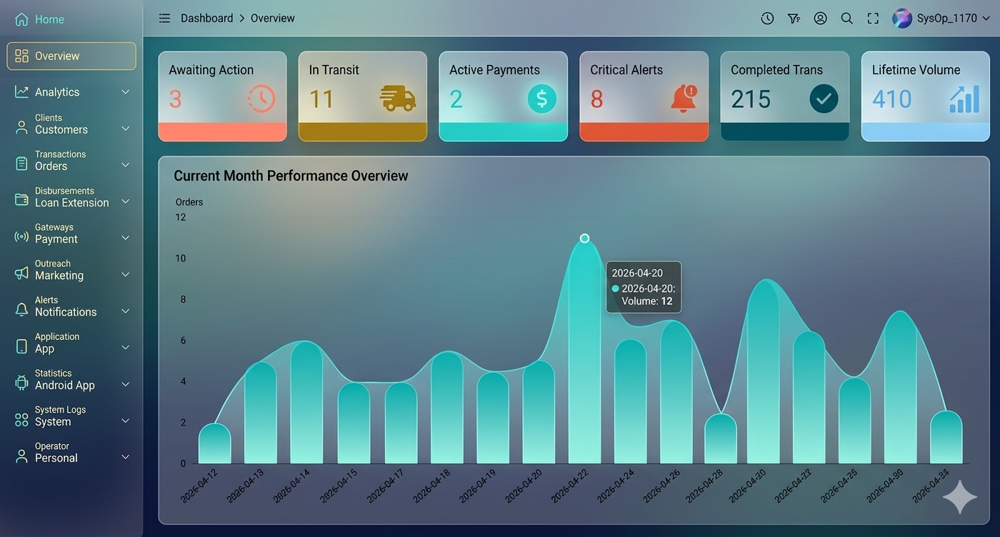
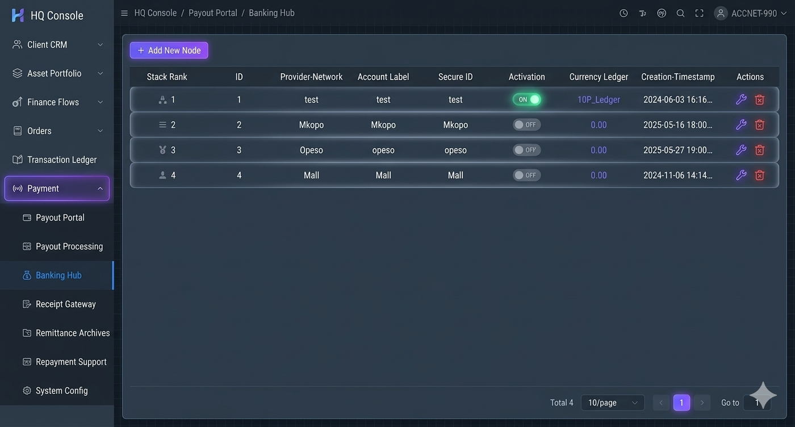
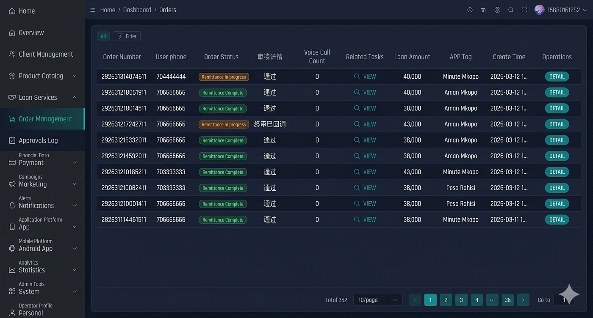
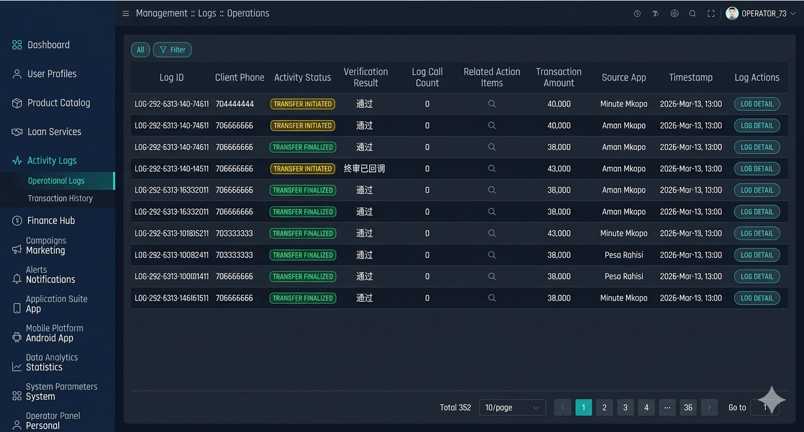
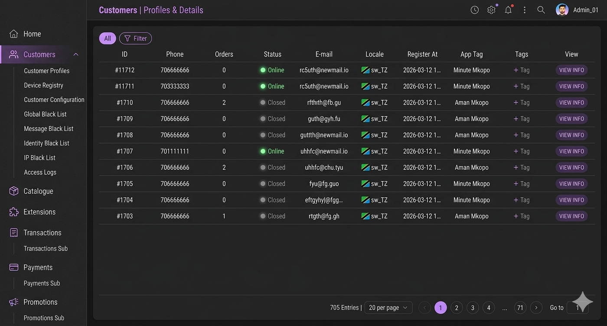

# Overseas Loan Management System

A professional **Overseas Loan Management System** designed for lending companies, microfinance institutions and fintech startups.

海外信贷系统 / Loan System / Lending Platform

---

## System Features

- Loan application management
- Customer management
- Loan approval workflow
- Repayment schedule
- Payment integration
- Collection management
- Financial reports
- Admin dashboard

---

## System Screenshots

Dashboard

Loan Management

Customer Management

Collection System

---

## Suitable For

- Overseas lending business
- Microfinance companies
- Consumer finance platforms
- Installment loan platforms

---

## Tech Stack

Backend

- Java
- Spring Boot
- MySQL
- Redis

Frontend

- Vue
- Element UI

---

## System Modules

- Loan Management
- Customer Management
- Repayment Management
- Collection Management
- Payment Integration
- Report System

---

## Demo

Contact for demo access.

---

## Source Code Purchase

Full commercial source code is available.

Contact:

Telegram  
WhatsApp  
Email

---

## License

This repository only shows partial code and system introduction.

Full source code requires commercial license.

# -micro-service

## System Architecture


This project adopts a Spring Cloud + Nacos based microservice architecture. All business services are exposed through API gateways, while Nacos is used internally for service discovery and configuration management.

## Microservice List

All microservices are registered in Nacos and are accessed and routed through `-gateway` or `-external-callback-gateway`.

- `-core`: Core external business service that provides user management, authentication, order management, and app configuration. Publicly accessible via gateway (`{gateway}/-core/**`).
- `-marketing`: Marketing and policy service that provides template management and notification policy management. Publicly accessible via gateway (`{gateway}/-marketing/**`).
- `-notification`: Notification center service that integrates third-party SMS, email, app push, and short-link providers.
- `-payment`: Payment service that integrates with third-party payment providers and exposes unified payout/payin capabilities.
- `-collection`: Post-loan collection service responsible for case management, outbound/phone collection, and performance statistics.
- `-risk-control`: Risk control service that includes decision engine, blacklists, and risk-control task scheduling.
- `-gateway`: API gateway service providing unified routing, authentication, and rate-limiting entry.
- `-monitor`: Monitoring service based on Spring Boot Admin for service status monitoring and operations.
- `-google-play`: Google Play data scraping and analysis related service.
- `-external-callback-gateway`: External callback gateway that receives callbacks from third parties and forwards them to internal services.

Shared and base modules:

- `-common-web`: Shared web-layer components and base abstractions.
- `-utils`: Utility classes and common helper methods.

## Database

The project uses MySQL as the primary data store and Flyway for database change management. Each microservice maintains its own schema:

- **Core DB (`-core`)**: User, order, repayment plan, product, dictionary, file, tag and other core-business tables.
- **Collection DB (`-collection`)**: User, case, contact, notification, performance and other collection-related tables.
- **Payment DB (`-payment`)**: Account, pay-in/pay-out applications and transactions, channel configuration tables.
- **Notification DB (`-notification`)**: Notification configuration, SMS/email/app-push, short-link related tables.
- **Risk-control DB (`-risk-control`)**: Blacklists, decision tasks and execution logs.
- **Marketing DB (`-marketing`)**: Banner and marketing configuration tables.
- **Common DB (`-common-web`)**: System events, distributed lock (shedlock) tables.
- **Google Play DB (`-google-play`)**: App scraping batches, categories, tags and related tables.

Database schemas are managed via Flyway migration scripts under each module's `src/main/resources/flyway/` directory. Initial data is stored under each module's `init-data/` directory.

## Functional Modules

From a business capability perspective, the system can be divided into the following functional modules:

- **User & Authentication**: Registration, login, authentication status management, device and behavior auditing (`-core`).
- **Order & Repayment**: Loan application, order creation, repayment plan generation, extension, and overdue management (`-core`).
- **Post-loan Collection**: Case assignment, collection actions, notification triggering, and performance statistics (`-collection`).
- **Risk Control & Blacklist**: Application decisioning, customer/IP/device blacklists, and risk-control task scheduling (`-risk-control`).
- **Payment & Cash Flow**: Pay-in/pay-out applications, payment query, failure retry, and reconciliation support (`-payment`).
- **Notification & Marketing**: Template management, notification policies, bulk SMS/email/app push, short-link tracking, and banner configuration (`-notification`, `-marketing`).
- **Monitoring & Operations**: Service discovery, health checks, Spring Boot Admin monitoring, and event logging (`-monitor`, `-common-web`).

## Deployment

This project is organized as a Maven multi-module project. Each microservice can be packaged and deployed independently. Typical deployment options:

- **Configuration & Service Registry**: Nacos is used for configuration management and service discovery. Each environment uses the corresponding Nacos namespace and DataId configured in `application-*.yml`.
- **Runtime options**:
  - Run as executable Spring Boot JAR: `java -jar <service>.jar --spring.profiles.active=<env>`
  - Or build Docker images and deploy via Docker/Kubernetes (each module provides Dockerfiles).
- **Entry points**:
  - `-gateway` exposes core and marketing APIs to external clients.
  - `-external-callback-gateway` receives callbacks from third parties and forwards them to internal microservices.

  ----

  ## Commercial Source Code Available

  Full commercial source code is available. Includes:

    Full Source Code
    Database Script
    Deployment Guide
    Technical Support

## Third-party Dependencies

### Gateway

```xml
<dependency>
    <groupId>org.springframework.cloud</groupId>
    <artifactId>spring-cloud-starter-gateway</artifactId>
</dependency>
```

### SpringBoot Admin

```xml
<dependency>
    <groupId>de.codecentric</groupId>
    <artifactId>spring-boot-admin-starter-server</artifactId>
    <version>2.6.11</version>
</dependency>
```

### Nacos

```xml
<dependency>
    <groupId>com.alibaba.cloud</groupId>
    <artifactId>spring-cloud-starter-alibaba-nacos-discovery</artifactId>
    <exclusions>
        <exclusion>
            <groupId>org.springframework.cloud</groupId>
            <artifactId>spring-cloud-starter-netflix-ribbon</artifactId>
        </exclusion>
    </exclusions>
</dependency>
<dependency>
    <groupId>org.springframework.cloud</groupId>
    <artifactId>spring-cloud-starter-loadbalancer</artifactId>
</dependency>
<dependency>
    <groupId>com.alibaba.cloud</groupId>
    <artifactId>spring-cloud-starter-alibaba-nacos-config</artifactId>
</dependency>
```

### RabbitMQ

```xml
<dependency>
    <groupId>org.springframework.boot</groupId>
    <artifactId>spring-boot-starter-amqp</artifactId>
</dependency>
```

## Database change management

### Flyway

```xml
<dependency>
    <groupId>org.flywaydb</groupId>
    <artifactId>flyway-core</artifactId>
    <version>8.2.0</version>
</dependency>
```


---

# 【全球海外信贷系统源码】Java+Vue+MySQL｜完整贷款流程+风控评分+自动催收+多语言+监管报表

---

## ✅ 项目简介

本系统是一套**面向全球市场的海外信贷业务管理平台**，采用主流企业级技术栈开发，代码结构清晰、注释完整，可直接部署上线或二次开发。

适合以下买家：
- 想快速切入海外借贷市场的创业团队
- 需要信贷系统进行二次开发的外包公司
- 东南亚、非洲、拉美等新兴市场的金融科技公司
- 想做白标SaaS转售的独立开发者

---

## 代码架构 



## 🛠️ 技术栈

| 层级 | 技术 |
|------|------|
| 后端 | Java 17 + Spring Boot 3.x + Spring Security |
| 前端 | Vue 3 + Element Plus + Axios |
| 数据库 | MySQL 8.0 |
| 缓存 | Redis |
| 部署 | Docker / Nginx / 支持云服务器一键部署 |
| 接口规范 | RESTful API + Swagger文档 |

---

## 🔥 核心功能模块

### 一、完整贷款申请流程
- 借款人注册、实名认证、资料上传
- 在线申请贷款，支持多种贷款产品配置（额度/期限/利率灵活设置）
- 还款计划自动生成（等额本息/等额本金）
- 借款人端查看账单、还款记录、申请状态

### 二、智能风控评分模型
- 多维度评分体系（身份、收入、行为、历史记录）
- 评分规则后台可配置，无需改代码
- 自动审批 / 人工复核 / 拒贷三档分流
- 风控决策日志全程留存

### 三、自动催收系统
- 逾期自动识别，按天数分级（M1/M2/M3）
- 自动发送催收通知（短信/邮件模板可配置）
- 催收工单分配，支持人工跟进记录
- 减免/展期/协议还款流程支持

### 四、多语言支持
- 前端i18n国际化框架，已内置英语
- 语言包结构清晰，扩展新语言只需添加配置文件
- 适配东南亚、拉美、非洲多国市场

### 五、监管报表
- 放款统计、回款统计、逾期分析
- 资金流水报表（支持按日/周/月导出）
- 监管所需格式报表（Excel导出）
- 图表可视化Dashboard，数据一目了然

---


---

## 📦 购买包含内容

- ✅ 完整前后端源码（无加密）
- ✅ 数据库建表SQL脚本
- ✅ 本地开发环境搭建文档
- ✅ 服务器部署文档（含Docker方案）
- ✅ Swagger接口文档
- ✅ 7天免费技术答疑（QQ/微信）

---

## 💰 适用场景 / 变现方式

| 用途 | 预期收益 |
|------|---------|
| 直接部署，对外承接信贷业务 | 按贷款规模盈利 |
| 二次开发后卖给金融公司 | 外包项目 ¥5万–¥50万 |
| 改造为白标SaaS按月收费 | $500–$5000/客户/月 |
| 定制后转售海外市场 | 海外项目利润更高 |

---

## ⚙️ 运行环境要求

- JDK 17+
- Node.js 18+
- MySQL 8.0+
- Redis 6.0+
- 服务器：2核4G起（推荐4核8G生产环境）

---

## 系统截图







## ❓ 常见问题

**Q：代码有加密吗？**
A：无任何加密，购买后获得完整源码，可自由修改商用。

**Q：能部署到海外服务器吗？**
A：完全支持，已在AWS、DigitalOcean、阿里云海外节点验证部署。

**Q：支持定制开发吗？**
A：支持，可联系作者报价，按需定制。

**Q：有演示地址吗？**
A：联系客服获取在线演示账号。

---

## 📞 联系方式

> 购买前建议先看演示，满意再下单
> QQ / 微信：18382383113
> weixin:
    
> 有任何技术问题，购买后7天内免费解答

---


